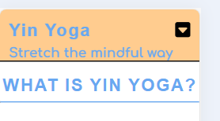
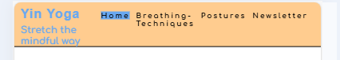
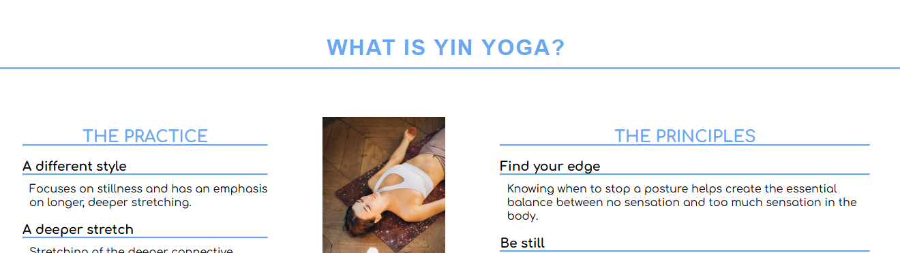
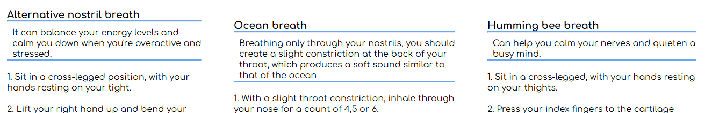
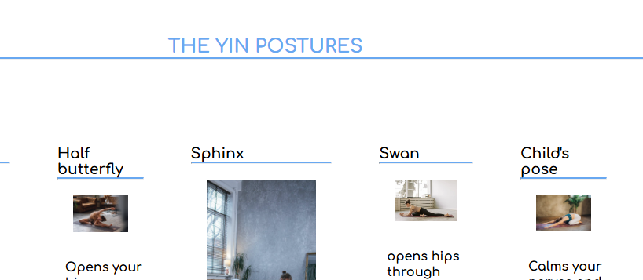
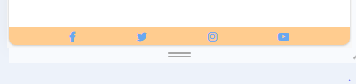
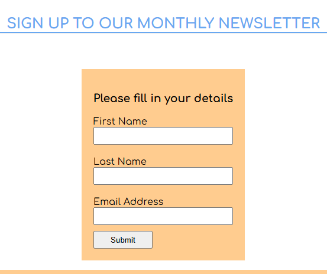
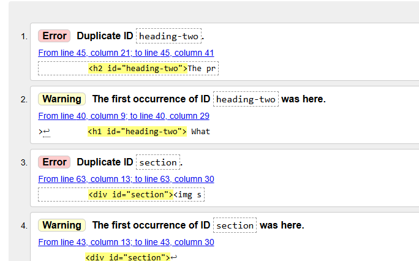

# YIN YOGA

YIN YOGA is a website for anyone that wants to know more about Yin Yoga.

This webiste provides information about the principles and practice of Yin Yoga, the breathing techniques and the Yin Yoga poses demonstrated and explained. There is also a newsletter form where user's can sign up to get news about Yin Yoga.

## Features

+ Navigation Bar

    

- In the top left corner of the navigation bar is the title: YIN YOGA - stretch the mindful way with a link to the landing page.
    - On the top right corner are the other navigation links: Breathing-techniques, postures, newsletter.
    - The fond is clean and clear, what perfectly represents Yin Yoga. easy to read
    - On small devices like phones, the navigation links are hidden and visible once clicked on the arrow in the top right corner.

+ Practice/Principles section

    - On the landing page are the two sections: THE PRACTICE and THE PRINCIPLES that explains what Yin Yoga is

+ Breathing Techniques

    -This section exlains what Pranayama means and shows three different breathing techniques.
    - the breathing techniques are explained in steps.
    - on top of the page shows a short video of meditation.

+ Postures

    -The posture section demostrates the different Yin Yoga styles and how to perform them in detailed steps.
    - every posture has a quick description of its benefits.
    - at the beginning of the page is the seated meditation explained, giving the user a perfect introduction to Yin Yoga.

* The Footer

    - The footer section shows icons of social media links, which open in a new tap when clicked on.

* Newsletter

    - The newsletter gives the user the opportunity to put in their contact details to receive the Yin Yoga newsletter.

## Testing
* I tested that the website works in different browsers: Chrome, Safari, Firefox.
* The website is responsive, looks good on phones, tablets and all standard screen sizes. I have used the devtools device toolbar to check the responsiveness.
* The navigation bar, landing page, breathing-techniques page, postures and newsletter section works.

## Validator testing

* i tested by website with the HTML validator and found some errors. I have dupolicated the section id and headint-two.
* I made the correct changes.

## Unfixed bugs
no unfixed bugs

## Deployment
* This website was deployed to GitHub pages. 
    - Click in the GitHub repository on settings.
    - In the Code and automation section, select Pages. select main branch, and make sure source is set to 'Deploy from Branch'.
    - Click the Code tab and go to the Environments section on the right-hand side, slick on 'github pages.'
    - Click 'View deployment'

This is the link to the website.

## Credits

### Content
    - The idea for the social media icons in the footer was taken from the Code Institute Loe Running Project.
    - I have used the formdump link fot the newsletter form. https://formdump.codeinstitute.net/

